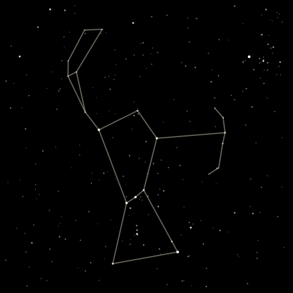

# Constellation Sketcher

[](https://www.npmjs.com/package/constellation-sketcher) 

A small library that animates the drawing of constellations. Originally designed to be a nice thing to watch while waiting on a long-running task (i.e. more than just a spinner).

A React component is available: [github](https://github.com/svank/react-constellation-sketcher), [npm](https://www.npmjs.com/package/react-constellation-sketcher)

[Live demo](https://samvankooten.net/constellation_sketcher)

Static screenshot:



## Description

Constellation Sketcher can render constellations either immediately or as an animation, drawing lines from star to star. Animated drawing starts at a randomly-selected star and draws lines to all connected stars, then to all stars connected to those stars, etc... Accurate background stars are included, and all stars flicker!

I learned while building this that there is simply *no* canonical source for what the constellations look like (that is, which stars to connect to which, and even which stars are included at all!). Constellation Sketcher uses the traditional Western constellations as provided in [Stellarium](http://stellarium.org/). The exact positions and magnitudes of stars are drawn from the [catalog](https://ui.adsabs.harvard.edu/abs/1997A%26A...323L..49P) produced by ESA's [Hipparcos](https://www.cosmos.esa.int/web/hipparcos) mission.

The minified library weighs in at about 110 kb, most of which is stellar data.

## Installation

```
npm i constellation-sketcher
```

The installed library can be accessed via
```
const ConstellationSketcher = require('constellation-sketcher');
```
or
```
import * as ConstellationSketcher from 'constellation-sketcher';
```

Alternatively, you can include the JS bundle file directly in a `script` tag:
```
<script src="https://unpkg.com/constellation-sketcher@^1.0.0/dist/constellation_sketcher.bundle.js"></script>
```

## Use

When started, Constellation Sketcher looks for a `<canvas>` element with `id="constellation-sketcher"`, the size of which can be set through its `width` and `height` attributes. (Note that Constellation Sketcher works best with a 1:1 aspect ratio. Different aspect ratios will effectively crop the view on both sides of the constellation.) Constellation Sketcher supports drawing to only one canvas at a time.

Drawing can be started via either of two functions:

* `ConstellationSketcher.sketch()` will draw one constellation.

* `ConstellationSketcher.slideshow()` will draw constellations one after the other, with a short pause in between. The slideshow will start with the currently-configured constellation and select random constellations after.

All drawing, including lines and stellar twinkle, can be canceled via `ConstellationSketcher.stop()`. ConstellationSketcher's state can be reset with `ConstellationSketcher.reset()`---useful if the `<canvas>` element is removed and later replaced.

A list of valid constellation names can be accessed via `ConstellationSketcher.constellationNames`.

## Selecting Constellations

Constellation Sketcher can display a specific constellation on demand, or it can display randomly-selected constellations. This is configured through the functions

* `ConstellationSketcher.setConstellation(constellation)`: Sets the name of the constellation that will be drawn next.

* `ConstellationSketcher.chooseRandomConstellation()`: Randomly selects the next constellation to be drawn.

* `ConstellationSketcher.getConstellation()`: Returns the name of the currently shown constellation.

* `ConstellationSketcher.getNextConstellation()`: Returns the name of the next constellation to be shown, as set via `setConstellation()` or `chooseRandomConstellation()`, or `null` if no future constellation is configured. (During slideshows, future constellations are set automatically.)

When randomly choosing constellations, different weights can be assigned to each of four constellation categories, which have been chosen based on the judgment of this northern-hemisphere author. Category membership is listed at the bottom of this README. The categories are:

* *Popular*: well-known constellations. Default weight: 2

* *Striking*: constellations that generally are large, have a more complex shape, and/or include a high density of background stars within the view. Default weight: 2

* *Small*: very simple constellations, generally only one or two lines. Default weight: 0

* *Medium*: constellations that are neither *small* nor *striking*. Default weight: 1

The latter three categories are mutually-exclusive, but *popular* constellations are each included in one of the other three groups. A constellation's weight during selection is the largest of the weights assigned to the categories it is a member of. Weights can be set through the following functions, each of which accepts a numeric weight.

* `ConstellationSketcher.setSelectionWeightPopular(weight)`

* `ConstellationSketcher.setSelectionWeightStriking(weight)`

* `ConstellationSketcher.setSelectionWeightMedium(weight)`

* `ConstellationSketcher.setSelectionWeightSmall(weight)`

* `ConstellationSketcher.setSelectionWeightsAll(weight)`: Assigns the given weight to all categories.

Additionally, arrays of the constellations included in each category are accessible via `ConstellationSketcher.categories`, e.g. `ConstellationSketcher.categories.popular`.

## Configuration

Constellation Sketcher can be configured through a set of functions. Each configuration function returns `ConstellationSketcher` so that calls can be chained (e.g. `ConstellationSketcher.setSelectionWeightsAll(1).chooseRandomConstellation().setAnimated(false).sketch()`). Configuration values are only guaranteed to affect future calls to `sketch()` or `slideshow()` and may but are not guaranteed to affect any animations currently in progress.

* `ConstellationSketcher.setAnimated(animated)`: Accepts a boolean. If true, constellations are drawn as an animation. If false, they are drawn immediately upon the start of drawing. The default is `true`.

* `ConstellationSketcher.setDrawLines(drawLines)`: Accepts a boolean. If false, lines are not drawn, only stars. The default is `true`.

* `ConstellationSketcher.setTwinkle(twinkle)`: Accepts a boolean. If true, stars twinkle. The default is `true`.

* `ConstellationSketcher.setTwinkleAmplitude(twinkleAmplitude)`: Accepts a number which multiplies the amount stars change in magnitude when flickering. The default is `1`.

* `ConstellationSketcher.setTwinkleTimescale(twinkleTimescale)`: Accepts a number of milliseconds. This is the time between updates to the twinkle-based changes in stellar magnitude. The default is `70`.

* `ConstellationSketcher.setSizeScale(sizeScale)`: Accepts a number which multiplies the widths of the stars that are drawn. The default is `1`.

* `ConstellationSketcher.setSpeedScale(speedScale)`: Accepts a number which multiplies the speed at which lines grow during animation. The default is `1`.

* `ConstellationSketcher.setSlideshowDwellTime(dwellTime)`: Accepts a number of milliseconds. This is the length of the pause during slideshows between the end of drawing one constellation and the beginning of drawing the next. The default is `4000`.

* `setCrossFade(doCrossFade, crossFadeTime)`: Accepts up to two arguments. The first is a boolean setting whether or not Constellation Sketcher will fade between constellations. The second, if provided, sets the duration of the fade in milliseconds. The default values are `true` and `750`.

* `setFadeIn(doFadeIn, fadeInTime)`: Accepts up to two arguments. The first is a boolean setting whether or not Constellation Sketcher will fade in from transparency before drawing its first constellation. The second, if provided, sets the duration of the fade in milliseconds. The default values are `false` and `750`.

* `ConstellationSketcher.setDrawBeginCallback(drawBeginCallback)`: Accepts a function which is called at the beginning of drawing a constellation. The callback function is provided as arguments a CanvasRenderingContext2D for drawing to the canvas and the name of the current constellation.

* `ConstellationSketcher.setDrawFrameCompleteCallback(drawFrameCompleteCallback)`: Accepts a function which is called at the end of drawing each frame. The callback function is provided as arguments a CanvasRenderingContext2D for drawing to the canvas, a boolean indicating whether the whole canvas was cleared and redrawn this frame, and the name of the current constellation.

* `ConstellationSketcher.setDrawCompleteCallback(drawCompleteCallback)`: Accepts a function which is called at the end of drawing a constellation. The callback function is provided as arguments a CanvasRenderingContext2D for drawing to the canvas and the name of the current constellation.

## Constellation Categories

These categories are described in the "Selecting Constellations" section above.

Popular | | | | (19 total) |
---|---|---|---|---
Andromeda | Aquarius | Aquila | Cancer | Canis Major
Capricornus | Cassiopeia | Centaurus | Cygnus | Draco
Gemini | Hydra | Orion | Pegasus | Sagittarius
Scorpius | Taurus | Ursa Major | Ursa Minor

Striking | | | | (22 total) |
---|---|---|---|---
Aquarius | Canis Major | Carina | Centaurus | Cetus
Cygnus | Draco | Eridanus | Hercules | Hydra
Lupus | Monoceros | Orion | Pegasus | Phoenix
Pisces | Sagittarius | Scorpius | Serpens | Taurus
Ursa Major | Virgo

Medium | | | | (39 total) |
---|---|---|---|---
Andromeda | Aquila | Ara | Aries | Auriga
Bootes | Camelopardalis | Cancer | Capricornus | Cassiopeia
Cepheus | Columba | Corona Australis | Corona Borealis | Corvus
Crater | Crux | Delphinus | Dorado | Gemini
Grus | Hydrus | Lacerta | Leo | Leo Minor
Lepus | Libra | Lynx | Lyra | Ophiuchus
Pavo | Perseus | Piscis Austrinus | Puppis | Sculptor
Scutum | Ursa Minor | Vela | Volans

Small | | | | (27 total) |
---|---|---|---|---
Antlia | Apus | Caelum | Canes Venatici | Canis Minor
Chamaeleon | Circinus | Coma Berenices | Equuleus | Fornax
Horologium | Indus | Mensa | Microscopium | Musca
Norma | Octans | Pictor | Pyxis | Reticulum
Sagitta | Sextans | Telescopium | Triangulum | Triangulum Australe
Tucana | Vulpecula